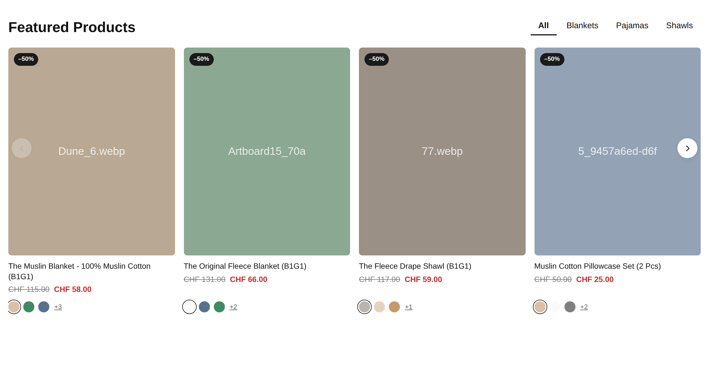

# Produkt-Tabs — Section mit Theme-Editor-Einstellungen

Dieselbe Optik wie die Custom-Liquid-Fassung, aber vollständig im
Theme-Editor bedienbar: Überschrift, Farben, Anzahl der Karten und vor allem
die Collections je Tab per Klick statt als Handle im Code.

---

## Einbau — eine einzige Datei

**Es wird keine bestehende Theme-Datei angefasst.** Kein Eingriff in
`main-product.liquid`, kein Snippet, nichts. Nur eine neue Datei anlegen:

1. Shopify Admin → **Onlineshop** *(Online Store)* → **Themes**
2. Beim aktiven Theme auf die drei Punkte **`...`** → **Duplizieren** (Backup)
3. Wieder **`...`** → **Code bearbeiten** *(Edit code)*
4. Links den Ordner **Sections** anklicken → darunter
   **Neuen Abschnitt hinzufügen** *(Add a new section)*
5. Name eintragen: **`featured-collection-tabs`**
   (ohne `.liquid`, das hängt Shopify an; falls ein Dateityp abgefragt wird:
   **Liquid**, nicht JSON)
6. ⚠️ Shopify füllt die neue Datei mit einer **Beispielvorlage**.
   Ins Code-Feld klicken, `Strg/Cmd + A`, `Entf` — alles löschen.
7. Den kompletten Inhalt von `sections/featured-collection-tabs.liquid`
   einfügen → **Speichern**

Das war der gesamte Code-Teil.

## Benutzen — im Theme-Editor

1. **Onlineshop → Themes → Anpassen** *(Customize)*
2. Oben in der Mitte die Vorlage wählen, auf der der Abschnitt erscheinen soll —
   **Startseite**, **Produkte → Standard-Produkt**, **Collections**, jede geht
3. Linke Spalte ganz unten: **Abschnitt hinzufügen** *(Add section)*
4. **„Produkt-Tabs"** auswählen
5. Der Abschnitt bringt drei leere Tabs mit („All", „New", „Sale").
   Jeden Tab links anklicken → rechts **Collection** auswählen
6. Per Drag & Drop an die richtige Stelle ziehen → **Speichern**

**Tabs verwalten:** Links im Abschnitt auf **Block hinzufügen → Tab** für einen
weiteren (bis zu 8), am Griff ziehen zum Sortieren, Mülleimer zum Löschen.
Die **Beschriftung** bleibt leer = es wird der Name der Collection angezeigt.

Ein Klick auf einen Tab-Block in der linken Spalte öffnet den passenden Tab in
der Vorschau — so siehst du direkt, was du gerade bearbeitest.

---

## Alle Einstellungen

| Bereich | Einstellung | Standard |
|---|---|---|
| Inhalt | **Überschrift** | „Featured Products" |
| Inhalt | **Produkte je Tab** | 8 (2–20) |
| Karussell | **Karten nebeneinander (Desktop)** | 4 — Auswahl: 2, 3, 4, 5 |
| Karussell | **Karten nebeneinander (Tablet)** | 3 — Auswahl: 2, 3, 4 |
| Karussell | **Karten nebeneinander (Mobil)** | 1.6 — Auswahl: 1, 1,2, 1,6 – nächste Karte lugt hervor, 2, 2,5 |
| Karussell | **Abstand zwischen den Karten** | 16px (8–40) |
| Karussell | **Pfeile anzeigen** | an |
| Produktkarte | **Bildformat** | 4 / 5 — Auswahl: Hochformat 4:5, Quadratisch, Hochformat 3:4 |
| Produktkarte | **Ecken-Radius Bild** | 6px (0–24) |
| Produktkarte | **Rabatt-Badge anzeigen** | an |
| Produktkarte | **Farbfelder anzeigen** | an |
| Produktkarte | **Farbfelder vor dem „+N“** | 3 (0–8) |
| Farben | **Badge Hintergrund** | `#1a1a1a` |
| Farben | **Badge Text** | `#ffffff` |
| Farben | **Aktionspreis** | `#c82828` |
| Abschnitt | **Volle Breite** | aus |
| Abschnitt | **Maximale Breite** | 1400px (800–1600) |
| Abschnitt | **Abstand oben** | 40px (0–100) |
| Abschnitt | **Abstand unten** | 40px (0–100) |

Pro Tab-Block: **Collection** und **Beschriftung**.

---

## Gut zu wissen

- **Rabatt-Badge** wird aus `compare_at_price` gerechnet, nicht getippt.
  CHF 115 → CHF 58 ergibt automatisch `–50%`.
- **Farbfelder** kommen aus der Produktoption „Color" / „Colour" / „Farbe"
  und nutzen Shopifys native Swatches
  (Admin → Einstellungen → Produkte → Swatches). Ohne die zeigt der Code
  stattdessen das Variantenbild als Punkt.
  Ein Klick tauscht Bild, Preis und Produktlink der Karte.
- **Kein Swiper, kein jQuery.** Das Karussell läuft über CSS-Scroll-Snapping,
  es kommt also keine zweite Karussell-Bibliothek neben die des Themes.
- **Schrift und Grundfarben** erbt der Abschnitt vom Theme
  (`--color-foreground` / `--color-background`), passt sich also an, wenn du
  das Theme-Farbschema änderst. Nur Badge- und Aktionspreis-Farbe sind
  eigene Einstellungen.
- Der Abschnitt kann **mehrfach** auf einer Seite stehen, jede Instanz mit
  eigenen Einstellungen — das CSS ist auf die jeweilige Abschnitts-ID begrenzt.
- **Theme-Updates** überschreiben ihn nicht: `sections/featured-collection-tabs.liquid`
  ist eine neue Datei, keine Theme-Datei.

## Unterschied zur Custom-Liquid-Fassung

| | Custom Liquid | Diese Section |
|---|---|---|
| Einbau | Code ins Editor-Feld | eine Datei in `sections/` |
| Überschrift, Farben, Anzahl | im Code | im Theme-Editor |
| Collections | Handles im Code | Auswahl per Klick |
| Tabs hinzufügen/sortieren | Code bearbeiten | Drag & Drop |

Die Custom-Liquid-Fassung unter `custom-liquid/` bleibt als Alternative
liegen — beide können auch parallel existieren.
